# JuriSight: Advanced Legal AI Platform - Full-Stack Setup Design

## Overview

JuriSight is a comprehensive AI-powered legal document analysis platform designed to streamline legal workflows through intelligent document processing, analysis, and collaborative features. This design outlines the complete full-stack architecture for a production-ready monorepo implementation.

### Core Value Proposition
- **Automated Legal Document Analysis**: AI-powered document processing with OCR fallback
- **Intelligent Insights**: RAG-based querying with vector similarity search
- **Collaborative Workspaces**: Team-based document management with RBAC
- **Comparative Analysis**: Clause-by-clause document comparison with similarity scoring
- **Real-time Analytics**: Usage tracking and performance monitoring

### Target Users
- Legal professionals and law firms
- Legal departments in corporations
- Compliance teams
- Contract managers

## Technology Stack & Dependencies

### Frontend Stack
- **Framework**: React 18+ with Vite for development
- **Styling**: TailwindCSS with Radix UI components
- **State Management**: Zustand for global state
- **Routing**: React Router v6
- **Data Fetching**: TanStack Query (React Query)
- **Testing**: React Testing Library + Cypress E2E

### Backend Stack
- **Runtime**: Node.js with Express.js framework
- **Database**: PostgreSQL with pgvector extension
- **ORM**: Prisma for database operations
- **Caching**: Redis for session storage and query caching
- **Authentication**: JWT with Role-Based Access Control
- **File Processing**: Multer for uploads, pdf-parse for text extraction

### AI Integration
- **Primary**: Google Gemini API for document analysis
- **Secondary**: OpenAI GPT (fallback option)
- **Vector Search**: pgvector for embeddings storage
- **Text Processing**: Custom chunking and embedding pipeline

### DevOps & Infrastructure
- **Containerization**: Docker with Docker Compose
- **Reverse Proxy**: Nginx for load balancing and SSL termination
- **Monitoring**: OpenTelemetry for observability
- **CI/CD**: GitHub Actions with automated testing

## Architecture

### System Architecture Overview

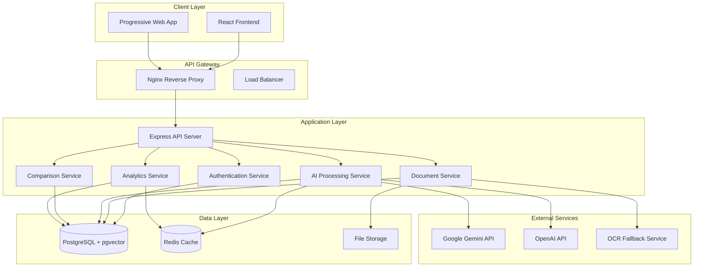

### Component Architecture

#### Frontend Component Hierarchy

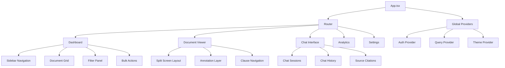

#### Backend Service Architecture

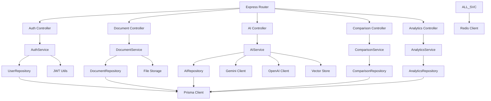

## Data Models & Database Schema

### Core Entity Relationships

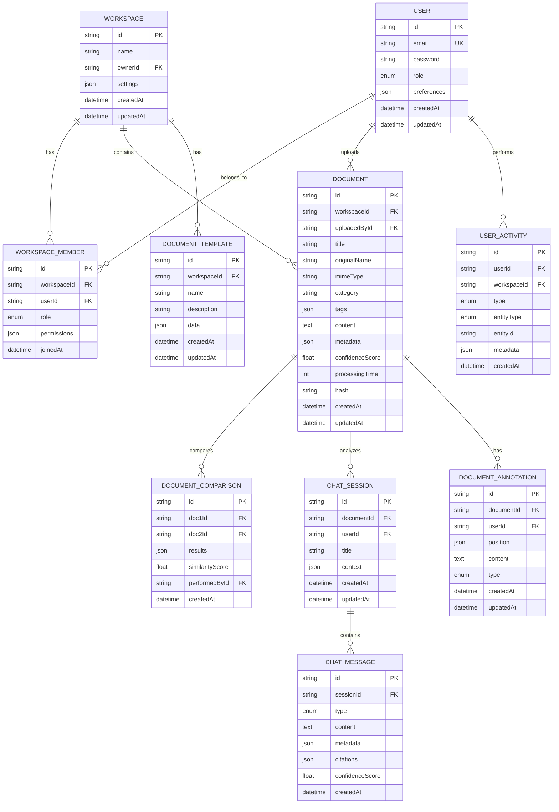

### Prisma Schema Structure

```prisma
// Core entities with relationships
model User {
  id           String   @id @default(cuid())
  email        String   @unique
  password     String
  role         UserRole @default(ANALYST)
  preferences  Json?
  createdAt    DateTime @default(now())
  updatedAt    DateTime @updatedAt
  
  // Relations
  workspaces         WorkspaceMember[]
  uploadedDocuments  Document[]
  chatSessions       ChatSession[]
  annotations        DocumentAnnotation[]
  activities         UserActivity[]
  performedComparisons DocumentComparison[]
}

model Workspace {
  id        String   @id @default(cuid())
  name      String
  ownerId   String
  settings  Json?
  createdAt DateTime @default(now())
  updatedAt DateTime @updatedAt
  
  // Relations
  members   WorkspaceMember[]
  documents Document[]
  templates DocumentTemplate[]
  activities UserActivity[]
}

model Document {
  id              String   @id @default(cuid())
  workspaceId     String
  uploadedById    String
  title           String
  originalName    String
  mimeType        String
  category        String?
  tags            Json?
  content         String?
  metadata        Json?
  confidenceScore Float?
  processingTime  Int?
  hash            String   @unique
  createdAt       DateTime @default(now())
  updatedAt       DateTime @updatedAt
  
  // Relations
  workspace    Workspace            @relation(fields: [workspaceId], references: [id])
  uploadedBy   User                 @relation(fields: [uploadedById], references: [id])
  chatSessions ChatSession[]
  annotations  DocumentAnnotation[]
  comparisons1 DocumentComparison[] @relation("Document1")
  comparisons2 DocumentComparison[] @relation("Document2")
}
```

## API Endpoints Reference

### Authentication & Authorization

```http
POST   /api/auth/register
POST   /api/auth/login
POST   /api/auth/logout
POST   /api/auth/refresh
GET    /api/auth/profile
PUT    /api/auth/profile
```

**Authentication Flow:**
- JWT-based authentication with refresh tokens
- Role-based access control (Admin, Manager, Analyst, Viewer)
- Session management with Redis storage

### Document Management

```http
GET    /api/documents                    # List documents with filters
POST   /api/documents                    # Upload new document
GET    /api/documents/:id                # Get document details
PUT    /api/documents/:id                # Update document metadata
DELETE /api/documents/:id                # Delete document
POST   /api/documents/:id/analyze        # Trigger AI analysis
GET    /api/documents/:id/download       # Download original file
```

**Request/Response Schema:**

```typescript
// Document upload request
interface DocumentUploadRequest {
  file: File;
  title?: string;
  category?: string;
  tags?: string[];
}

// Document analysis response
interface DocumentAnalysisResponse {
  id: string;
  analysis: {
    summary: string;
    keyPoints: string[];
    entities: Entity[];
    confidence: number;
  };
  embeddings: number[];
  processingTime: number;
}
```

### AI Processing & Chat

```http
POST   /api/ai/analyze                   # Analyze document content
POST   /api/ai/chat                      # Chat with document
GET    /api/ai/sessions/:documentId      # Get chat sessions
POST   /api/ai/sessions                  # Create chat session
GET    /api/ai/sessions/:id/messages     # Get chat messages
```

### Document Comparison

```http
POST   /api/comparisons                  # Create document comparison
GET    /api/comparisons/:id              # Get comparison results
GET    /api/comparisons                  # List comparisons
```

### Analytics & Reporting

```http
GET    /api/analytics/dashboard          # Dashboard metrics
GET    /api/analytics/usage              # Usage statistics
GET    /api/analytics/performance        # Performance metrics
```

## Business Logic Layer

### Document Processing Pipeline

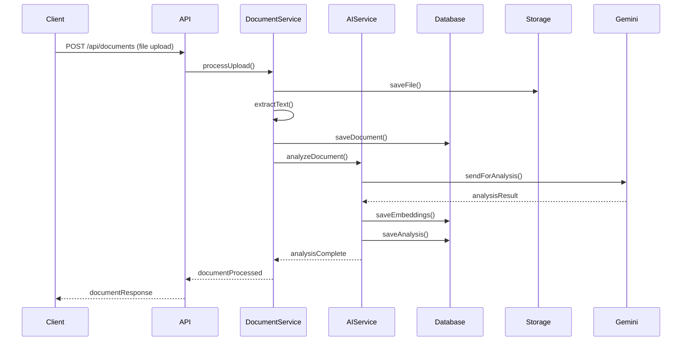

### AI Analysis Architecture

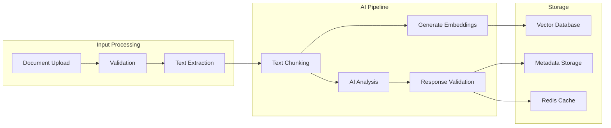

### RAG Implementation Flow

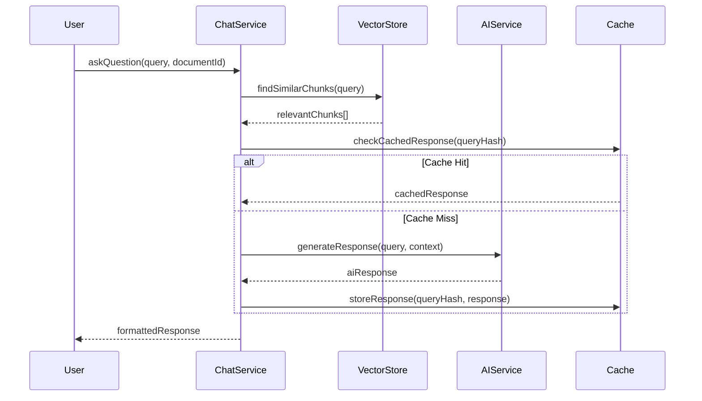

## State Management & Data Flow

### Frontend State Architecture

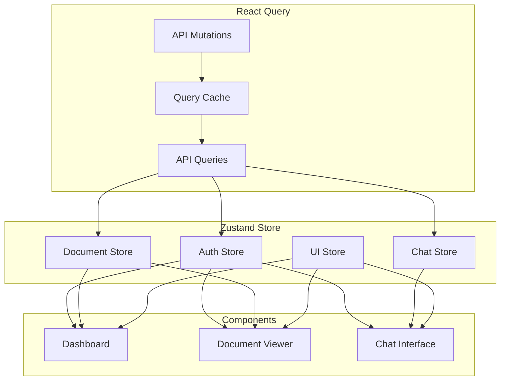

### Backend Data Flow

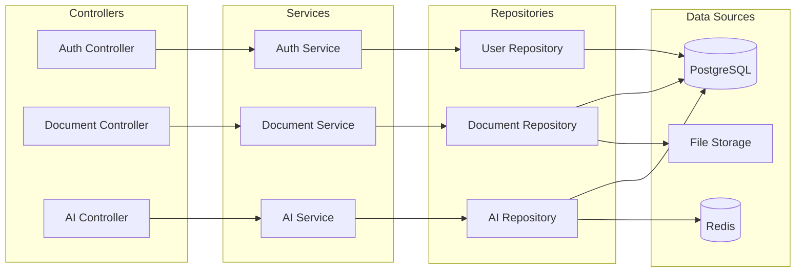

## Deployment Architecture

### Docker Compose Structure

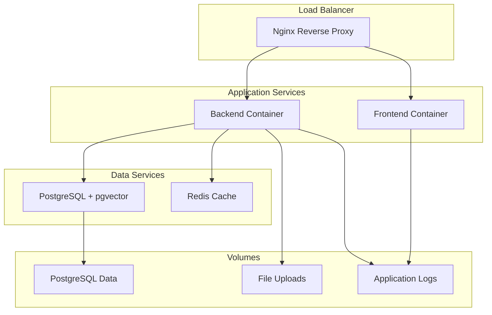

### Production Environment Setup

```yaml
# docker-compose.prod.yml structure
services:
  nginx:
    image: nginx:alpine
    ports: ["80:80", "443:443"]
    volumes: 
      - ./nginx/prod.conf:/etc/nginx/nginx.conf
      - ./ssl:/etc/ssl/certs
    
  frontend:
    build: ./client
    environment:
      - NODE_ENV=production
    
  backend:
    build: ./server
    environment:
      - NODE_ENV=production
      - DATABASE_URL=${DATABASE_URL}
      - REDIS_URL=${REDIS_URL}
    volumes:
      - uploads:/app/uploads
      - logs:/app/logs
    
  database:
    image: pgvector/pgvector:pg15
    environment:
      - POSTGRES_DB=jurisight
      - POSTGRES_USER=${DB_USER}
      - POSTGRES_PASSWORD=${DB_PASSWORD}
    volumes:
      - postgres_data:/var/lib/postgresql/data
    
  redis:
    image: redis:alpine
    command: redis-server --appendonly yes
    volumes:
      - redis_data:/data
```

### CI/CD Pipeline Architecture

```mermaid
graph LR
    subgraph "Source Control"
        GIT[Git Repository]
        PR[Pull Request]
    end
    
    subgraph "CI Pipeline"
        TEST[Run Tests]
        LINT[Lint & Format]
        BUILD[Build Images]
        SCAN[Security Scan]
    end
    
    subgraph "CD Pipeline"
        DEPLOY_STAGING[Deploy to Staging]
        E2E[E2E Tests]
        DEPLOY_PROD[Deploy to Production]
        MONITOR[Health Check]
    end
    
    GIT --> PR
    PR --> TEST
    TEST --> LINT
    LINT --> BUILD
    BUILD --> SCAN
    SCAN --> DEPLOY_STAGING
    DEPLOY_STAGING --> E2E
    E2E --> DEPLOY_PROD
    DEPLOY_PROD --> MONITOR
```

## Testing Strategy

### Frontend Testing Architecture

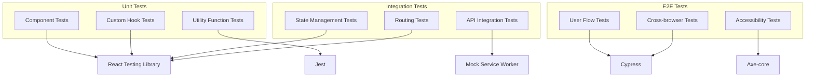

### Backend Testing Strategy

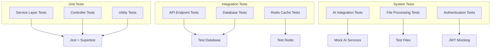